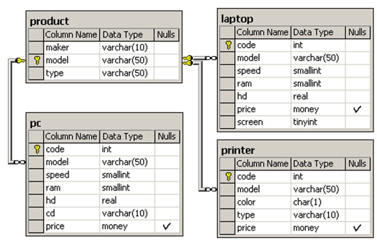

# Вводные:

`Product`    
<pre>
insert into Product values('B','1121','PC')                                                  
insert into Product values('A','1232','PC')                                    
insert into Product values('A','1233','PC')
insert into Product values('E','1260','PC')
insert into Product values('A','1276','Printer')
insert into Product values('D','1288','Printer')
insert into Product values('A','1298','Laptop')
insert into Product values('C','1321','Laptop')
insert into Product values('A','1401','Printer')
insert into Product values('A','1408','Printer')
insert into Product values('D','1433','Printer')
insert into Product values('E','1434','Printer')
insert into Product values('B','1750','Laptop')
insert into Product values('A','1752','Laptop')
insert into Product values('E','2113','PC')
insert into Product values('E','2112','PC')
</pre>

`PC`
<pre>
insert into PC values(1,'1232',500,64,5,'12x',600)
insert into PC values(2,'1121',750,128,14,'40x',850)
insert into PC values(3,'1233',500,64,5,'12x',600)
insert into PC values(4,'1121',600,128,14,'40x',850)
insert into PC values(5,'1121',600,128,8,'40x',850)
insert into PC values(6,'1233',750,128,20,'50x',950)
insert into PC values(7,'1232',500,32,10,'12x',400)
insert into PC values(8,'1232',450,64,8,'24x',350)
insert into PC values(9,'1232',450,32,10,'24x',350)
insert into PC values(10,'1260',500,32,10,'12x',350)
insert into PC values(11,'1233',900,128,40,'40x',980)
insert into PC values(12,'1233',800,128,20,'50x',970)
</pre>

`Laptop`
<pre>
insert into Laptop values(1,'1298',350,32,4,700,11)
insert into Laptop values(2,'1321',500,64,8,970,12)
insert into Laptop values(3,'1750',750,128,12,1200,14)
insert into Laptop values(4,'1298',600,64,10,1050,15)
insert into Laptop values(5,'1752',750,128,10,1150,14)
insert into Laptop values(6,'1298',450,64,10,950,12)
</pre>

`Printer`
<pre>
insert into Printer values(1,'1276','n','Laser',400)
insert into Printer values(2,'1433','y','Jet',270)
insert into Printer values(3,'1434','y','Jet',290)
insert into Printer values(4,'1401','n','Matrix',150)
insert into Printer values(5,'1408','n','Matrix',270)
insert into Printer values(6,'1288','n','Laser',400)
</pre>

#### 1.	Найдите номер модели, скорость и размер жесткого диска для всех ПК стоимостью менее 500 долларов. Вывести: model, speed и hd.

SELECT model, speed, hd                                     
FROM PC                                                
WHERE price <500;                                            

#### 2.	Найдите производителей принтеров. Вывести: maker.

SELECT DISTINCT maker                                       
FROM Product                                                   
WHERE type = 'Printer';                                              

#### 3.	Найдите номер модели, скорость и размер жесткого диска ПК, имеющих 12х или 24х CD и цену менее 600 долларов.

SELECT model, speed, hd                                                     
FROM PC                                  
WHERE (cd = '12x' OR cd = '24x') AND price < 600;                                   

#### 4.	Найдите производителя, продающего ПК, но не ноутбуки.

SELECT DISTINCT maker                                              
FROM Product                                                        
WHERE type = 'PC' AND maker NOT IN (                                               
    SELECT DISTINCT maker                             
    FROM Product                                        
    WHERE type = 'Laptop'                                                  
);                                     

#### 5.	Найдите среднюю скорость ПК, выпущенных производителем A.                               

SELECT AVG(pc.speed) AS avg_speed                                       
FROM PC                              
JOIN Product ON PC.model = Product.model                          
WHERE Product.maker = 'A';                                              

#### 6.	Для таблицы Product получить результирующий набор в виде таблицы со столбцами maker, pc, laptop и printer, в которой для каждого производителя требуется указать, производит он (yes) или нет (no) соответствующий тип продукции. В первом случае (yes) указать в скобках без пробела количество имеющихся в наличии (т.е. находящихся в таблицах PC, Laptop и Printer) различных по номерам моделей соответствующего типа.

SELECT maker,                                              
       CASE WHEN SUM(CASE WHEN type = 'PC' THEN 1 ELSE 0 END) > 0                                   
            THEN CONCAT('yes(', COUNT(DISTINCT CASE WHEN type = 'PC' THEN model END), ')')                    
            ELSE 'no' END AS pc,                                                           
       CASE WHEN SUM(CASE WHEN type = 'Laptop' THEN 1 ELSE 0 END) > 0                                              
            THEN CONCAT('yes(', COUNT(DISTINCT CASE WHEN type = 'Laptop' THEN model END), ')')                      
            ELSE 'no' END AS laptop,                                                                         
       CASE WHEN SUM(CASE WHEN type = 'Printer' THEN 1 ELSE 0 END) > 0                                                 
            THEN CONCAT('yes(', COUNT(DISTINCT CASE WHEN type = 'Printer' THEN model END), ')')                                
            ELSE 'no' END AS printer                                
FROM Product                                                               
GROUP BY maker;                                                             

#### 7.	Найдите производителей самых дешевых цветных принтеров. Вывести: maker, price.

SELECT maker, price                                                          
FROM Product                                                                   
JOIN Printer ON Product.model = Printer.model                                    
WHERE color = 'y' AND price = (                                  
    SELECT MIN(price)                                   
    FROM Printer                                          
    WHERE color = 'y'                                          
);                                                

#### 8.	Используя таблицу Product, определить количество производителей, выпускающих по одной модели.

SELECT COUNT(*) AS single_model_makers                                                
FROM (                                                                                                      
    SELECT maker                                                                                          
    FROM Product                                                            
    GROUP BY maker                                                              
    HAVING COUNT(model) = 1                                                                  
) AS single_makers;                                                                                

